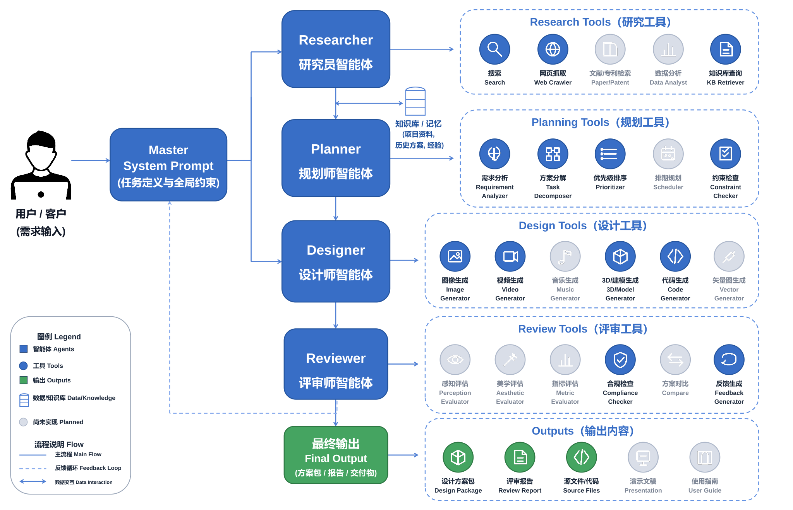

# Dreamatic

[English](README.md) | [简体中文](README.zh-CN.md)

**Harness for Professional Design Agents** — Direct creativity, orchestrate intelligence, deliver professional design.


Dreamatic is a controllable agent runtime that goes beyond simple chat. Agents can understand requests, plan work, call tools, persist context, request human approval, spawn sub-agents, and stream execution in real time — all within persistent sessions.

The current release focuses on a general-purpose runtime layer suitable for design agents, research workspaces, local automation assistants, and multi-agent systems requiring predictable execution, tool governance, and observable long-running work.

## Quick Start

### 1. Create virtual environment (recommended)

Dreamatic requires **Python >= 3.11**.

```bash
python3 -m venv .venv
source .venv/bin/activate        # macOS/Linux
# .venv\Scripts\activate         # Windows
pip install --upgrade pip
```

### 2. Install

```bash
pip install -e ".[dev]"
```

### 3. Configure

```bash
cp .env.example .env
# Fill in provider credentials
```

You can configure credentials either by editing `.env` directly or by opening
**Settings -> Models & API** in the Web UI. The settings panel manages the same
Dreamatic environment variables and can import `.env` profile files.

#### Model providers

The default runtime provider uses OpenAI-compatible variables:

```env
DREAMATIC_API_KEY=your-api-key
DREAMATIC_BASE_URL=https://your-endpoint/v1
DREAMATIC_MODEL=gpt-4o
HARNESS_DEFAULT_PROVIDER=openai-hub
```

Compression/summarization can use a smaller model so long sessions stay cheaper:

```env
DREAMATIC_SUMMARY_API_KEY=your-summary-api-key
DREAMATIC_SUMMARY_BASE_URL=https://your-endpoint/v1
DREAMATIC_SUMMARY_MODEL=gpt-4o-mini
```


#### Search tools

`web_search` works best with a configured search provider:

```env
DREAMATIC_SEARCH_PROVIDER=serper
DREAMATIC_SEARCH_API_KEY=your-search-key
```

Compatibility variables are also accepted by the current search tools:

```env
SERPER_API_KEY=your-serper-key
BRAVE_SEARCH_API_KEY=your-brave-key
```

Without a real search key, the fallback search provider may return limited or
empty results.

#### Image generation and editing

`image_generate` and `image_edit` use these variables:

```env
DREAMATIC_IMAGE_API_KEY=your-image-api-key
DREAMATIC_IMAGE_BASE_URL=https://your-image-endpoint/v1
DREAMATIC_IMAGE_MODEL=gpt-image-2
DREAMATIC_IMAGE_GENERATION_ENDPOINT=https://your-image-endpoint/v1/images/generations
DREAMATIC_IMAGE_EDIT_ENDPOINT=https://your-image-endpoint/v1/images/edits
DREAMATIC_IMAGE_DEFAULT_SIZE=1024x1024
DREAMATIC_IMAGE_BACKEND=codex
```

`DREAMATIC_IMAGE_DEFAULT_SIZE` is only the fallback size. A workflow or tool call
may still request a specific supported size for a given deliverable.

#### Video generation

`video_generate` is optional and intended for providers with task-style video APIs:

```env
DREAMATIC_VIDEO_API_KEY=your-video-api-key
DREAMATIC_VIDEO_BASE_URL=https://ark.ap-southeast.bytepluses.com
DREAMATIC_VIDEO_MODEL=seedance-1-5-pro-251215
DREAMATIC_VIDEO_ENDPOINT=https://ark.ap-southeast.bytepluses.com/api/v3/contents/generations/tasks
DREAMATIC_VIDEO_DEFAULT_RESOLUTION=720p
DREAMATIC_VIDEO_DEFAULT_DURATION=5
DREAMATIC_VIDEO_BACKEND=codex
```

Provider constraints matter: text-to-video and image-to-video models may support
different durations, resolutions, and input modes.

#### Optional 3D generation

`hunyuan3d` is optional and only used when the user explicitly asks for a 3D
model or a format such as GLB, OBJ, FBX, STL, or USDZ.

```env
DREAMATIC_HUNYUAN3D_API_KEY=your-hunyuan3d-key
DREAMATIC_HUNYUAN3D_BASE_URL=https://tokenhub.tencentmaas.com/v1/api/3d
DREAMATIC_HUNYUAN3D_MODEL=hy-3d-3.1
```

Generated 3D assets are supplementary. In design workflows they are saved under
`<runDir>/artifacts/models/` and `<runDir>/artifacts/model-renders/`; they do not
replace the required PNG image set or gallery.

### 4. Start Web UI

```bash
python -m uvicorn api.rest:app --port 8000
# Open http://localhost:8000
```

> Use `python -m uvicorn` instead of the raw `uvicorn` command to ensure it runs within the current virtual environment. Avoid `--reload` as agent file writes can trigger restart and interrupt sessions.

### 5. Or use CLI

```bash
python cli.py --persona builder
```

## Key Features

| Area | Capabilities |
| --- | --- |
| **Entry points** | Web UI, interactive CLI, REST + WebSocket API |
| **Agent runtime** | ReAct-style loop with cancellation, recovery, and real-time streaming |
| **Model providers** | OpenAI-compatible and Anthropic; configured via `config.yaml` and `.env` |
| **Built-in tools** | 30+ tools: file ops, search, shell, web search/fetch, image/video/3D generation, memory, planning, sub-agents |
| **Persistence** | SQLite-backed messages, plans, memory, checkpoints, and session relationships |
| **Security** | Per-tool approval gates, persona-scoped permissions, output limits, SSRF protection |
| **Extensibility** | Personas (agent roles), Skills (reusable procedures), Commands (project shortcuts), MCP bridge |
| **Context management** | Automatic compression and prompt caching for long-running sessions |
| **Multi-agent** | Parent sessions spawn sub-agents for research, planning, review, and documentation |
| **Observability** | WebSocket streams model rounds, tool calls, results, plan changes, and approval events |

## Architecture

Dreamatic is organized into six runtime layers.


### Agent Workflow and Tool Map



| Layer | Responsibility |
|---|---|
| Entry | Web UI, CLI, REST API, WebSocket streaming |
| Session | Create, restore, rename, pin/archive, parent-child relationships, runtime modes |
| Agent runtime | State machine (6 states), ReAct controller, prompt assembly, context compression, prompt cache |
| Tool & Provider | 30+ built-in tools, OpenAI-compatible & Anthropic LLM providers, MCP bridge |
| Extension | Personas (roles), Skills (procedures), Commands (shortcuts), MCP bridge |
| Storage | SQLite or in-memory backends for SessionStore, MemoryStore, PlanStore, CheckpointStore |

**Execution flow**: User sends a request → engine assembles prompt (system + persona + skills + memory + plan + history) → model responds or requests tool calls → tools pass through approval gate → results stream to frontend → loop continues or final answer returned.

## Design Examples

Each example includes a full-resolution final package and artifact gallery.

### Brand & Merchandise: Jingju Guochao Series

A cultural merchandise system inspired by Peking opera facial makeup. [Open package](examples/jingju-guochao-merch/final/00-index.html)

| Product system | Packaging | Series overview |
|---|---|---|
|  |  |  |

### Brand & Merchandise: Tongji IDVX Lab

Lab merchandise — bags, notebooks, badges. [Open package](examples/tongji-idvx-lab-merch/final/00-index.html)

| Tote hero | Notebook cover | Badge system |
|---|---|---|
|  |  |  |

### Product Design: Elderly AI Companion Device

A companion device concept for elderly living alone. [Open package](examples/elderly-ai-companion-device/final/00-index.html)

| Hero render | Three-view | CMF board |
|---|---|---|
|  |  |  |

### Architecture: Zhujiajiao Visitor Center

Visitor center concept for an ancient water town. [Open package](examples/zhujiajiao-visitor-center-space/final/00-index.html)

| Site context | Zoning | Entry hall |
|---|---|---|
|  |  |  |

### Poster & Advertising: IEEE VIS 2026

Conference promotion — posters, social media, badges, templates. [Open package](examples/ieee-vis-2026-promo/final/00-index.html)

| Main poster | Key visual | Social post |
|---|---|---|
|  |  |  |

### Campus Campaign: Shanghai Innovation Institute

Bilingual campaign with merch mockups and moodboards. [Open package](examples/shanghai-chuangzhi-college-merch-system/final/00-index.html)

| Logo poster | Chinese poster | Merch mockup |
|---|---|---|
|  |  |  |

### Product Design: VibeCoding Creative Compact Input

A dedicated input device for creative professionals working with AI-native workflows. [Open package](examples/vibecoding-creative-compact-input/final/00-index.html)

| Hero render | Usage scene | Form language |
|---|---|---|
|  |  |  |

## Repository Layout

```
.
|-- api/                # FastAPI REST + WebSocket server
|-- harness/            # Agent runtime, tools, storage, LLM providers
|   |-- engine/         # Main loop, state machine, compression, prompt cache
|   |-- tools/          # Built-in tools and execution layer
|   |-- storage/        # SQLite and in-memory backends
|   |-- llm/            # Provider abstraction and implementations
|   |-- mcp/            # MCP bridge and transports
|   `-- commands/       # Built-in and project command system
|-- static/             # Browser frontend
|-- .myharness/         # Personas, skills, commands, transcripts
|-- tests/              # Tests
|-- cli.py              # CLI entry point
|-- config.yaml         # Runtime configuration
`-- pyproject.toml
```

## Configuration

### config.yaml

| Setting | Description |
|---|---|
| `default_provider` | Default model provider |
| `providers` | Provider definitions (OpenAI-compatible / Anthropic) |
| `engine.max_rounds` | Max model/tool loop rounds per task |
| `compression` | Token window, trigger ratio, summary provider |
| `storage` | SQLite or in-memory |
| `tools.enabled` | Globally enabled tools |
| `tools.confirm_tools` | Tools requiring human confirmation |
| `tools.limits` | Per-tool output/execution limits |
| `mcp_servers` | Optional MCP server definitions |

### Personas, Skills, Commands

Project-local behavior in `.myharness/`:

```
.myharness/
|-- personas/    # Agent roles (builder, planner, reviewer, etc.)
|-- skills/      # Reusable procedures (SKILL.md per skill)
|-- commands/    # Project-level shortcuts
`-- transcripts/ # Runtime transcripts
```

**Personas** define system prompt, default provider, approval mode, and allowed tools. **Skills** are injected by name at startup; full content loads on `use_skill`. **Commands** are project shortcuts exposed via CLI and Web UI.

### Built-in Tools

| Tool | Purpose |
|---|---|
| `read_file`, `write_file`, `edit_file`, `create_directory`, `list_dir`, `write_json` | File operations |
| `search`, `grep`, `glob` | Code/text search |
| `shell`, `powershell` | Local command execution |
| `web_search`, `web_fetch` | Web search and page extraction |
| `image_generate`, `image_edit` | Image generation and editing |
| `video_generate` | Optional video generation through task-style video providers |
| `hunyuan3d` | Optional 3D model generation with preview renders and metadata |
| `todo_write` | Plan creation and updates |
| `memory` | Persistent memory read/write |
| `think` | Explicit reasoning notes |
| `background_task` | Long-running background work |
| `spawn_agent`, `spawn_agents` | Sub-agent creation |
| `use_skill` | Load skill instructions on demand |

## Web UI

The Web Workspace supports creating, switching, renaming, pinning, archiving, and deleting sessions; selecting provider/persona/approval mode; real-time message and tool-call viewing; historical message editing with regeneration; and editing skills/personas/config.

## Question Mode

Two session-level modes: `noquestion` (direct execution, default) and `question` (agent asks clarification when information is missing).

```bash
python cli.py --persona builder --question-mode question
curl -X PATCH http://localhost:8000/sessions/{id}/mode \
  -H "Content-Type: application/json" \
  -d '{"question_mode": "question"}'
```

## REST & WebSocket API

| Endpoint | Purpose |
|---|---|
| `POST /sessions` | Create/restore session |
| `GET /sessions` | List sessions |
| `GET /sessions/{id}/state` | Session snapshot |
| `POST /sessions/{id}/messages` | Send message |
| `PATCH /sessions/{id}/messages/{mid}` | Edit & optionally regenerate |
| `POST /sessions/{id}/continue` | Continue from recoverable state |
| `POST /sessions/{id}/cancel` | Cancel running task |
| `POST /sessions/{id}/confirm` / `deny` | Approve/deny pending tool call |
| `PATCH /sessions/{id}/approval-mode` | Change approval mode |
| `PATCH /sessions/{id}/mode` | Change question mode |
| `GET /config/agents` | List agent profiles |
| `GET /memory` / `POST /memory` | Manage memory |
| `GET /commands` | List project commands |
| `WS /ws/{session_id}` | Stream runtime events |

## Security

Built-in controls: approval gates for high-risk tools (shell, powershell), persona-scoped tool permissions, output caps, env-var secrets, SSRF protection in web_fetch, explicit state machine for runtime transitions. For untrusted-user exposure, use least-privilege personas, disable unnecessary tools, run in a controlled network, and add authentication/rate limiting/audit logging.

## Development

```bash
pytest                              # Full suite
pytest tests/test_engine.py         # Engine tests
python scripts/loc.py               # Count lines of code
```

## FAQ

**Provider not found?** — Check provider names in `config.yaml` and `HARNESS_DEFAULT_PROVIDER` in `.env`.

**Web search empty?** — Set `SERPER_API_KEY` or `BRAVE_SEARCH_API_KEY`; fallback is limited DuckDuckGo.

**Should I use `uvicorn` or `python -m uvicorn`?** — Always use `python -m uvicorn`. The raw `uvicorn` command may invoke a system-wide installation (e.g. from pipx) that uses a different Python path and won't find project dependencies installed in the virtual environment.

**Avoid `uvicorn --reload`?** — File writes from agents can trigger restart and interrupt sessions.

**Skill not auto-invoked?** — Check its `SKILL.md` description is clear. Use `/<skill-name>` to invoke manually.

## License

[MIT License](LICENSE)
