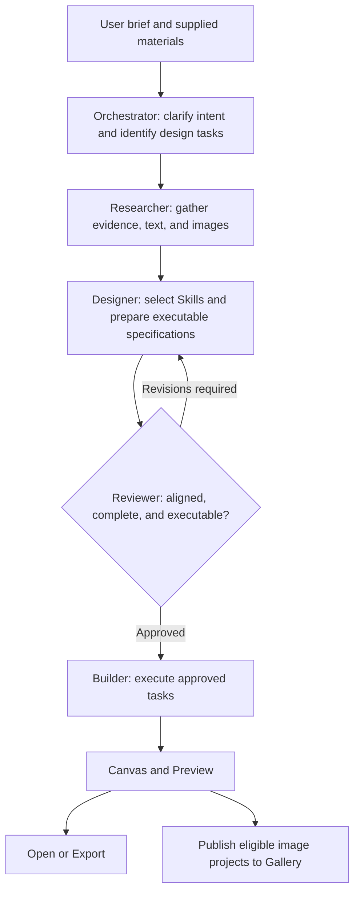

# DreamaticArt

**Turn a creative brief into reviewed design specifications, visual designs, and interactive interfaces.**

DreamaticArt is an open-source AI design system built on Pi. It coordinates specialist agents to clarify requirements, research materials, develop designs, review specifications, and produce deliverables. Projects retain their requirements, references, plans, reviews, and results in a local workspace.

Use DreamaticArt through the macOS desktop app, the Web interface, or the CLI.

**[Official website](https://www.dreamatic.art)** · **[Source code](https://github.com/idvxlab/Dreamatic)** · **[MIT license](LICENSE)**


> This README describes the current **2.0.3 source version**. The installer available on the website may have a different version; check its download details.

## Contents

- [Core capabilities](#core-capabilities)
- [Design workflow](#design-workflow)
- [Installation](#installation)
- [Using DreamaticArt](#using-dreamaticart)
- [Publishing to Gallery](#publishing-to-gallery)
- [CLI](#cli)
- [Development](#development)
- [Troubleshooting](#troubleshooting)

## Core capabilities

### Design across disciplines

DreamaticArt supports brand and visual communication, industrial and product design, architecture and spatial design, media design, and UX/UI. A project can combine multiple disciplines.

| Task | Current deliverables |
| --- | --- |
| UX/UI | HTML/CSS/JavaScript pages and local interactions, produced from reviewed specifications through HTML tools |
| Brand, product, industrial, architecture, and media design | Design images, perspectives, and detail views produced through image generation or editing tools |
| Mixed projects | Image and HTML deliverables assembled into the presentation declared in the approved plan |

Professional **Skills** supply domain knowledge and reusable methods. Designer selects the appropriate Skills for each task.

Current visual outputs communicate design intent. CAD, engineering-grade 3D, video, and game-engine output are not implemented. HTML interfaces support local interactions; production backend integration is separate work.

### Research and material reuse

Provide URLs, images, or documents in the conversation. Researcher can search independently and extract useful text and images from supplied materials. Supported extraction includes webpages, text, and modern Office documents; scanned documents, PDFs, and older file formats have limitations that the system reports.

Designer selectively references researched material. When you explicitly request reuse of particular text or images, the workflow imports and incorporates those materials according to your instructions.

### A persistent design workspace

- **Projects:** reopen, rename, revise, or move projects to recoverable local trash.
- **Canvas:** inspect and arrange references, notes, and generated outputs.
- **Preview:** view image collections in a structured showcase or interact with the actual HTML delivery. Multi-page HTML projects retain a page selector.
- **Export:** download a ZIP containing outputs, sources, assets, design plans, and research while excluding sessions and system credentials.
- **Bilingual UI:** switch between English and Chinese. Dialogs follow the system language; project content is not automatically translated.
- **Model records:** final deliveries and previews identify reasoning and image models. Missing records in older projects can be supplemented at publication from current settings, with that provenance labeled.

### Share completed designs

Publish eligible image designs to the [official Gallery](https://www.dreamatic.art/gallery) directly from Preview. Publication includes creator attribution, upload progress, and confirmed replacement of an earlier version at the same URL.

**HTML UX/UI projects, including mixed projects containing HTML deliverables, are temporarily ineligible for Publish.** HTML showcase pages for image collections remain eligible. Preview and Export remain available for HTML projects.

## Design workflow

Orchestrator clarifies the brief and coordinates the agents. Reviewer approves the specification before Builder executes it. Required revisions return to Designer.


```mermaid
flowchart TD
    User["User brief and supplied materials"] --> O["Orchestrator: clarify intent and identify design tasks"]
    O --> R["Researcher: gather evidence, text, and images"]
    R --> D["Designer: select Skills and prepare executable specifications"]
    D --> V{"Reviewer: aligned, complete, and executable?"}
    V -->|Revisions required| D
    V -->|Approved| B["Builder: execute approved tasks"]
    B --> P["Canvas and Preview"]
    P --> E["Open or Export"]
    P --> G["Publish eligible image projects to Gallery"]
```

| Agent | Responsibility |
| --- | --- |
| **Orchestrator** | Understand goals, ask clarification questions, identify design types, and coordinate the workflow. It does not perform research, design, or audits directly. |
| **Researcher** | Search for evidence and references; extract useful text and images from user-provided URLs and files. |
| **Designer** | Select and load Skills; produce clear, detailed, executable design specifications. |
| **Reviewer** | Check alignment with user requirements, important omissions, and executability; approve or request revisions. |
| **Builder** | Execute Designer's approved specifications without a second design review, and create a hierarchical showcase for image deliverables. |

## Installation

### macOS desktop app

For **Apple Silicon Macs (arm64)**:

1. Download the installer from the [official website](https://www.dreamatic.art/#download).
2. Open the DMG and drag the app into **Applications**.
3. Launch the app and open **Designer → Settings** to configure your model providers.
4. Click **New project** to begin.

The desktop app bundles its runtime; a separate Node.js installation is unnecessary. Model and search calls still require internet access, and model calls use your configured API keys.

Configuration and projects are stored in `~/Library/Application Support/Dreamatic/` and survive app upgrades. Source-based Web projects are not imported automatically.

Local installers use ad-hoc signing. If macOS blocks launch, verify the download source, then allow the app through **System Settings → Privacy & Security**.

<a id="web-and-cli-installation"></a>

### Web and CLI from source

#### Requirements

| Dependency | Requirement |
| --- | --- |
| Node.js | **22.19 or newer** |
| npm | **10 or newer** |
| Git | For cloning the repository |
| Reasoning provider | A vision-capable model using a compatible Chat Completions or Responses protocol |
| Image provider | A compatible generation/editing service for image tasks |
| `zip` | Available on the server's `PATH` for Export and Publish |
| Chromium browser | An installed Chromium-based browser, such as Chrome, for HTML browser validation; source installs do not download one automatically |

#### Set up the project

```bash
git clone https://github.com/idvxlab/Dreamatic.git
cd Dreamatic
npm ci
cp .env.example .env
```

On Windows PowerShell, use `Copy-Item .env.example .env` and ensure a compatible `zip` executable is installed.

Edit `.env` with your provider settings:

```env
DREAMATIC_API_KEY=your-reasoning-api-key
DREAMATIC_BASE_URL=https://your-reasoning-provider/v1
DREAMATIC_MODEL=your-vision-capable-model

DREAMATIC_IMAGE_API_KEY=your-image-api-key
DREAMATIC_IMAGE_BASE_URL=https://your-image-provider/v1
DREAMATIC_IMAGE_MODEL=your-image-model
```

Chat Completions is the default reasoning protocol. Set `DREAMATIC_PROVIDER_TYPE=openai-responses` for providers implementing Responses. Standard image endpoint paths are inferred; custom generation and editing endpoints can be configured separately. An omitted image API key falls back to the reasoning key.

Research uses DuckDuckGo by default; Serper is optional. See [.env.example](.env.example) for Agent-specific models, concurrency, retries, timeouts, and browser settings. Keep API keys out of Git.

#### Start the Web interface

For development:

```bash
npm run dev
```

Open the URL printed in the terminal, normally **http://localhost:5173**. The API defaults to **http://localhost:4310**. Keep the process running.

For the built application:

```bash
npm run build
npm start
```

Open **http://localhost:4310**.

Web and CLI use the repository's `workspace/` by default. Relative `DREAMATIC_WORKSPACE` paths resolve from the repository root. These instructions describe local use; HTML previews run on a separate local service origin.

## Using DreamaticArt

### 1. Configure providers and create a project

Open **Designer → Settings**. Configuration is grouped into search, reasoning models, image models, and system parameters. Agent-specific reasoning models override the default model when configured.

Only modified fields are saved. Leaving a key input blank preserves the existing secret. Port and workspace changes require a restart.

**An empty workspace does not automatically create a project.** Conversation input, attachments, and sending remain disabled until you click **New project**. Deleting the last project disables them again.

### 2. Describe the brief and material requirements

Specify the audience, purpose, style, deliverables, and content that must be retained. For example:

> Design packaging and a visual identity for a contemporary tea brand aimed at young adults. Use a restrained Eastern visual language and deliver a packaging hero view, a usage scene, and a collection overview.

> Extract and reuse the research description, publication text, and portrait photographs from my supplied website URL. Design a responsive academic homepage with English/Chinese switching, publication filtering, and mobile navigation.

Attach relevant images or documents. State explicitly which materials should be referenced, extracted, or reused unchanged. Answer clarification questions so the agents can proceed with an aligned brief.

### 3. Inspect and preview the result

Follow progress in the conversation and inspect project materials on Canvas. After completion, open **Preview**.

| Action | Behavior |
| --- | --- |
| **Open** | Open the delivered presentation separately; the desktop app uses a preview window |
| **Export** | Save the complete project ZIP; the desktop app uses a native save dialog |
| **Publish** | Upload eligible image projects to the official Gallery |

Extract an exported ZIP before opening its `index.html` launcher. Continue in the same project to request revisions; revised specifications are designed and reviewed before execution.

## Publishing to Gallery

1. Open **Preview → Publish** in a completed image project.
2. Verify the destination and enter optional creator information.
3. Confirm that the contents may be shared publicly. If an existing publication is detected, confirm replacement.
4. Wait for packaging, upload, and deployment, then open the returned project link.

The default destination is [https://www.dreamatic.art](https://www.dreamatic.art). Change `DREAMATIC_SITE_URL` in system settings to use another compatible site.

Creator name, organization, and website are self-declared; they do not activate authentication or represent a verified account. An empty name displays **Anonymous**.

The publication ZIP limit is **128 MiB**. It includes outputs, sources, and references, while excluding sessions, private runtime records, and hidden metadata files. Progress and waiting states prevent duplicate submission during publication.

The system generates a stable publication identifier and stores a private update credential locally. Confirmed republication replaces the earlier contents at the same URL. Older publications without a saved update credential cannot be automatically claimed for replacement.

Existing model records are retained. Missing reasoning or generation groups are supplemented from current settings in the publication package, labeled `publication_config_fallback`, and identified as supplemented in the online preview. This does not recover the historical models actually used.

The website's homepage shows recent projects; its dedicated Gallery supports categories, search, and pagination, with creator, date, and model information on project cards.

### Manual installation of projects on DreamaticSite

Website administrators can copy a project folder into `gallery/<project-name>/`. The scanner supports both `final/artifacts/` and `artifacts/`; refreshing the page discovers the project without rebuilding the frontend.

This manual administrative path also supports HTML projects. The temporary HTML restriction applies to the Publish upload flow. See the DreamaticSite project documentation for deployment and directory configuration.

## CLI

Build before first use:

```bash
npm run build
```

```bash
# Start a design task
npm run cli -- "Design a visual identity and poster system for a technology exhibition"

# Design an HTML interface
npm run cli -- "Design a responsive academic homepage with publication filtering"

# Attach a reference image
npm run cli -- --image ./reference.png "Preserve the logo and design a poster series"

# Start an interactive session
npm run cli

# Emit machine-readable events
npm run cli -- --json "Design a product concept"

# Resume after the original process has stopped
npm run cli -- --resume <run-id>

# Show all options
npm run cli -- --help
```

CLI tasks start directly from the terminal; the Web interface's empty-project input restriction does not apply to CLI task creation.

## Development

DreamaticArt extends Pi through its SDK, Extensions, Skills, and session APIs. Pi remains an upstream dependency.

| Directory | Purpose |
| --- | --- |
| `apps/web` | React interface, Canvas, and Preview |
| `apps/server` | HTTP/SSE, sessions, assets, and application policy |
| `apps/cli` | Command-line entry point |
| `apps/desktop` | macOS desktop application |
| `packages/design-agent` | Design tools, workflows, and delivery contracts |
| `.pi/agents` | Agent instructions |
| `.pi/skills` | Professional and supporting Skills |
| `workspace` | Local project and session output; generated runs are not committed |

### Check and build

```bash
npm run check
npm run build
```

After updating source, install locked dependencies, rebuild, restart the service, and refresh the browser. Building alone does not update a running backend.

### Build a macOS installer

On an Apple Silicon Mac:

```bash
npm run release:mac
```

The release branch must be named `v<major>.<minor>.<patch>`, such as `v2.0.3`. The script builds, checks, runs regression and desktop validation, and produces `release/DreamaticArt-<version>-mac-arm64.dmg` with a SHA256 file.

Use `npm run desktop` for desktop development.

## Troubleshooting

| Issue | What to check |
| --- | --- |
| Model calls fail | API key, base URL, model ID, and protocol; image services must support the requested generation/editing operation |
| Conversation input is disabled | Create or select a project first |
| An update has no effect | Rebuild, restart, and refresh; desktop changes require an updated application build |
| Publication fails | ZIP size, matching website API version, and Gallery storage permissions; concurrent uploads may wait in the queue |
| Unexpected hourly publication limit | The website's per-IP hourly cap is configurable and defaults to disabled; check its deployed configuration |
| A manually deleted work still has a local record | Publish checks the public Gallery; an unavailable website retains a conservative uncertainty warning |
| Older projects lack model records | Publish supplements missing groups from publication-time settings and labels their provenance |

Further reading: [Architecture](docs/ARCHITECTURE.md) · [Design and execution contracts](docs/V2.0.3.md) · [Performance and diagnostics](docs/PERFORMANCE.md)

## License

[MIT](LICENSE)
