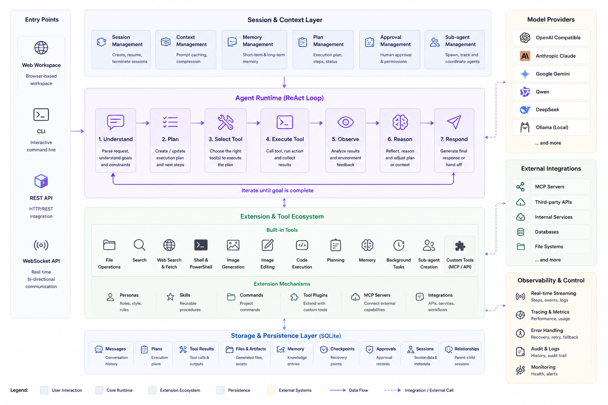
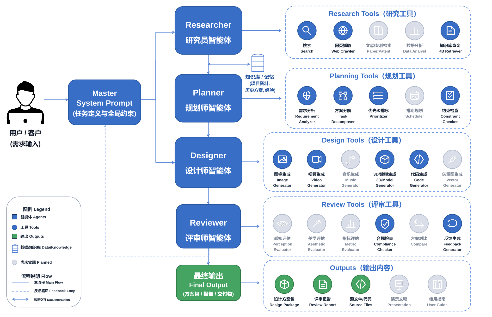

# Dreamatic

**A Pi-based harness for professional design agents** — turn a brief into a
traceable design process, a reviewed visual artifact set, and a standalone
showcase.


Dreamatic keeps Pi as a versioned dependency and extends it through its SDK,
Extensions, Skills, and session runtime. Pi provides the general agent loop;
Dreamatic provides the design-specific workflow, visual actions, artifact
contracts, Design Bus, project workspace, CLI, and React interface.

The `dev` branch is the current rebuilt baseline. A complete brief-to-output
run has been exercised with isolated Research, Planning, Design, and Critic
sessions, reference collection, image generation/editing, visual inspection,
repair, durable artifacts, Canvas presentation, and Showcase preview.

## Architecture boundary

| Pi dependency | Dreamatic extension |
| --- | --- |
| Model/provider abstraction | Design personas and domain Skills |
| Agent sessions and streaming | Multi-stage design orchestration |
| Tool registration and lifecycle | Image generation, editing, inspection, and comparison |
| Skill discovery/loading | Design Bus and artifact contracts |
| Context compaction and persistence | Image-context control and resumable Run files |
| General filesystem/shell tools | React project workspace and design CLI |

The same persistent Run is used by both entry points:

```text
brief → primary Pi session → specialist child sessions → visual artifacts
      → critique / scoped repair → reviewed package → Canvas + Showcase
```

## Requirements

- Node.js 22 LTS recommended; Node.js 20.19 or newer is required by the current
  Vite toolchain.
- npm 10 or newer.
- A vision-capable OpenAI-compatible text model.
- An OpenAI-compatible image generation endpoint. Image editing is strongly
  recommended for consistency and repair passes.

Python, a virtual environment, `uvicorn`, and the old `config.yaml` are no
longer used by this branch.

## Quick start

### macOS / Linux

```bash
git clone --branch dev https://github.com/idvxlab/Dreamatic.git
cd Dreamatic
cp .env.example .env
nano .env                         # fill in text and image provider settings
npm install
npm run dev
```

Open the Web URL printed by Vite, normally `http://localhost:5173`. The local
Dreamatic API listens on `http://localhost:4310`.

### Windows PowerShell

```powershell
git clone --branch dev https://github.com/idvxlab/Dreamatic.git
Set-Location Dreamatic
Copy-Item .env.example .env
notepad .env
npm install
npm run dev
```

If port `5173` is occupied, Vite automatically prints and uses the next free
port. Do not close the terminal while a Web-started task is running.

## Configuration

Dreamatic loads `<repo>/.env` for both Web and CLI. The Web Settings panel can
update the same provider fields, but keeping a local `.env` is the clearest
way to reproduce an environment. Never commit real API keys.

### Text / vision model

```env
DREAMATIC_API_KEY=your-text-model-key
DREAMATIC_BASE_URL=https://your-openai-compatible-host/v1
DREAMATIC_MODEL=your-vision-capable-model
DREAMATIC_PROVIDER_TYPE=openai-compatible
DREAMATIC_PROVIDER_NAME=Local profile
```

Set `DREAMATIC_PROVIDER_TYPE=openai-responses` only when the endpoint implements
the OpenAI Responses protocol. Otherwise the default OpenAI-compatible chat
completions protocol is used.

### Web research

Dreamatic uses DuckDuckGo without an API key by default. To use Serper instead,
configure:

```env
DREAMATIC_SEARCH_PROVIDER=serper
DREAMATIC_SEARCH_API_KEY=your-serper-key
```

The Research Agent keeps the same `websearch` tool contract with either
provider. `SERPER_API_KEY` is also accepted for compatibility with older
Dreamatic configurations. If Serper is not configured, Dreamatic automatically
uses DuckDuckGo.

### Image generation and editing

```env
DREAMATIC_IMAGE_API_KEY=your-image-key
DREAMATIC_IMAGE_BASE_URL=https://your-image-host/v1
DREAMATIC_IMAGE_MODEL=your-image-model
DREAMATIC_IMAGE_GENERATION_ENDPOINT=https://your-image-host/v1/images/generations
DREAMATIC_IMAGE_EDIT_ENDPOINT=https://your-image-host/v1/images/edits
DREAMATIC_IMAGE_RESPONSE_FORMAT=b64_json
DREAMATIC_IMAGE_DEFAULT_SIZE=1536x1024
```

`DREAMATIC_IMAGE_API_KEY` may be omitted when the image endpoint accepts the
same key as `DREAMATIC_API_KEY`. Explicit generation/edit endpoints are optional
when the provider follows the standard `/images/generations` and `/images/edits`
paths.

To diagnose image editing without running the full agent workflow:

```bash
# Configuration, DNS, and endpoint reachability only; does not create an image
npm run diagnose:image-edit

# One real image-edit request using the exact .env configuration; may be billable
npm run diagnose:image-edit -- --image "/absolute/path/to/reference.png"
```

The diagnostic hides the API key and reports the resolved endpoint, model,
input size, timeout, HTTP status, elapsed time, request ID, retry guidance, and
the provider error body. It works the same way on macOS, Linux, and Windows.

### Workspace and recovery

```env
PORT=4310
DREAMATIC_WORKSPACE=./workspace
DREAMATIC_AGENT_RETRY_ATTEMPTS=3
DREAMATIC_IMAGE_RETRY_ATTEMPTS=3
DREAMATIC_OPERATION_ATTEMPT_BUDGET=5
DREAMATIC_IMAGE_TIMEOUT_MS=300000
```

Web and CLI must point to the same `DREAMATIC_WORKSPACE`. This is what makes a
CLI-created, interrupted, or completed project appear in the React workspace.

## Web workspace

```bash
npm run dev
```

The React workspace provides project navigation, a live nested workflow stream,
reference and output previews, a persistent pan/zoom Canvas, and a Showcase
mode for the generated standalone gallery. Runs can be renamed or moved to the
recoverable local trash from the sidebar.

For a production-style local build:

```bash
npm run build
npm start
# open http://localhost:4310
```

## CLI

The CLI runs the same primary persona, Extensions, Skills, child sessions, and
workspace as the Web application.

```bash
# One complete design task
npm run cli -- "为一家当代茶品牌设计主视觉和包装系列"

# Attach one or more references
npm run cli -- --image ./references/logo.png "保留标志，设计一套发布海报"

# Interactive mode
npm run cli

# Machine-readable Pi event stream
npm run cli -- --json "设计一个科技展览主视觉"

# Long brief from a file (macOS/Linux)
cat brief.md | npm run cli --

# Resume a stopped Run; do this only after the original CLI process has ended
npm run cli -- --resume <run-id>
```

After `npm run build`, `npm link` can install the shorter `dreamatic` command
for the active Node installation.

## Durable Run model

Every project is stored under `workspace/runs/<run-id>`:

```text
brief.json                    normalized brief and domain scope
run-state.json                persisted workflow state
bus.jsonl                     append-only Design Bus and live lifecycle events
plan/                         task breakdown, design system, acceptance criteria
research/                     evidence, cached sources, and reference images
sessions/<persona>/           resumable Pi child-session histories
artifacts/                    generated, edited, and selected design artifacts
review/                       critique and evaluation evidence
final/                        exported self-contained package
canvas/canvas-state.json      Canvas positions and camera state
```

Large visual payloads are persisted as files instead of accumulating in model
history. Dreamatic sends bounded previews to the model, prevents duplicate
inspection of the same image within one stage invocation, prunes old base64
blocks from active context, and retains reloadable paths. Provider failures are
retried per concrete operation, and committed domain milestones can close a
specialist card even if its final transport event is lost.

## Repository layout

```text
apps/web                 React + Vite design workspace
apps/server              Local HTTP/SSE API and Run inventory
apps/cli                 One-shot, interactive, JSON, and resume CLI
packages/design-agent    Dreamatic Pi extension and visual tools
.pi/agents               Primary and specialist design personas
.pi/skills               Workflow, domain, critique, and visual Skills
workspace                Local Runs and Pi sessions (gitignored)
docs                     Architecture, migration, and UI contracts
```

## Development checks

```bash
npm run check
npm run build
npm test -w @dreamatic/design-agent
npm test -w @dreamatic/server
```

## Preserved design examples

The following visual examples are retained from the earlier Dreamatic README.
They describe prior design outputs, not the current TypeScript architecture.

### Brand & Merchandise: Jingju Guochao Series

| Product system | Packaging | Series overview |
|---|---|---|
|  |  |  |

### Brand & Merchandise: Tongji IDVX Lab

| Tote hero | Notebook cover | Badge system |
|---|---|---|
|  |  |  |

### Product Design: Elderly AI Companion Device

| Hero render | Three-view | CMF board |
|---|---|---|
|  |  |  |

### Architecture: Zhujiajiao Visitor Center

| Site context | Zoning | Entry hall |
|---|---|---|
|  |  |  |

### Poster & Advertising: IEEE VIS 2026

| Main poster | Key visual | Social post |
|---|---|---|
|  |  |  |

### Campus Campaign: Shanghai Innovation Institute

| Logo poster | Chinese poster | Merch mockup |
|---|---|---|
|  |  |  |

### Product Design: VibeCoding Creative Compact Input

| Hero render | Usage scene | Form language |
|---|---|---|
|  |  |  |

## Historical architecture illustrations

These diagrams are retained from the pre-Pi implementation for project history;
they do not describe the current runtime boundary above.





## License

[MIT License](LICENSE)
